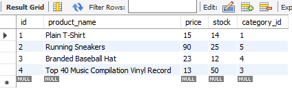

# e-commerce-app

E-commerce platforms provide a suite of services to businesses of all sizes. This is a back end for an e-commerce site.

- You will configure a working Express.js API which uses Sequelize to interact with a MySQL database.
- This application demonstrate and allow users to view, add, edit, and delete categories, products, and tags.

## Project Description

e-commerce app works to provide a platform to the users.

- Create a github application named e-commerce-app.
- A functional Express.js Api is given.
- In the .env file, add the database name, MySQL username and MySQL password.
- Then, you could connect to a database using Sequelize.
- Enter schema and seed commands in the terminal. Then a development database is created.
- Enter the command to invoke the application.
- Then my server is started and the Sequelize models are synced to the MySQL database.
- Open API 'GET', 'GET id','POST','PUT', 'DELETE' routes in Postman for categories, products, and tags.
- Then the data for each of these routes is displayed in JSON file.
- Use Postman to test API routes GET, POST, PUT, DELETE.
- You will be able to create, update and delete data in the database.

## Screenshots

- Created a database in workbench

- Code to GET all categories

- Code to POST categories

- Code to PUT categories

- Code to DELETE categories

- Code to GET products

- Code to DELETE products

- Code to POST tags

- Code to PUT tags

- Code to DELETE tags

## Link to github

https://github.com/Etipriya/e-commerce-app

## Link to the screen castify video
